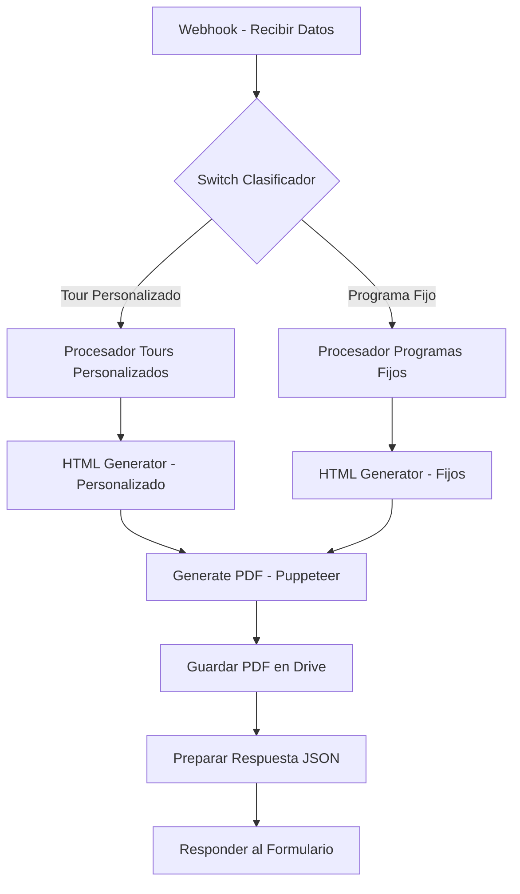

# Documentación Técnica del Workflow n8n

## 📋 Índice

1. [Descripción General](#descripción-general)
2. [Arquitectura del Workflow](#arquitectura-del-workflow)
3. [Nodos del Workflow](#nodos-del-workflow)
4. [Procesadores](#procesadores)
5. [Flujo de Datos](#flujo-de-datos)
6. [Configuración de Google Drive](#configuración-de-google-drive)
7. [Troubleshooting](#troubleshooting)

---

## 🎯 Descripción General

El workflow de n8n procesa automáticamente las solicitudes de cotización desde los formularios web, genera PDFs personalizados y los almacena en Google Drive de manera organizada.

### Características Principales

- ✅ **Procesamiento dual estandarizado**: Tours personalizados y programas fijos
- ✅ **Generación automática de PDFs** con paridad visual (V3.0)
- ✅ **Almacenamiento organizado** en Google Drive (por año/mes)
- ✅ **26 actividades mapeadas** para tours personalizados
- ✅ **10 programas fijos** predefinidos con mapeo inteligente
- ✅ **Motor Puppeteer Unificado**: Elimina dependencia de Google Docs
- ✅ **Cálculos automáticos** de precios, fechas y saldos
- ✅ **Diseño Premium**: Times New Roman, bordes y sombras 5px

### Versiones Actuales

- **Procesador Tours Personalizados**: v8.0-UNIFIED-DESIGN-FINAL
- **Procesador Programas Fijos**: v7.4-HTML-PARITY-CORREGIDO

---

## 🏗️ Arquitectura del Workflow (v3.0)



---

## 🔧 Nodos del Workflow

### 1. Webhook - Recibir Datos

**ID**: `242d29d6-25c3-4a7d-a5a9-50e725ca3235`  
**Tipo**: `n8n-nodes-base.webhook`  
**Path**: `/generar-pdf`

**Configuración**:
```json
{
  "httpMethod": "POST",
  "responseMode": "lastNode",
  "options": {
    "responseHeaders": {
      "Access-Control-Allow-Origin": "*",
      "Access-Control-Allow-Methods": "POST, OPTIONS",
      "Access-Control-Allow-Headers": "Content-Type, Authorization"
    }
  }
}
```

**Datos recibidos**:
- `tipo_tour`: "personalizado" | "fijo"
- `nombre_cliente`: string
- `email`: string
- `fecha_viaje`: date
- Y más campos según el tipo de tour

---

### 2. Switch Clasificador

**ID**: `ef2aa32b-64b1-4e68-aa9f-6a60bf073684`  
**Tipo**: `n8n-nodes-base.switch`

**Lógica de clasificación**:

```javascript
// Output 0: Tour Personalizado
$json.body.tipo_tour === "personalizado" || 
$json.body.tipo_tour === "customizado" || 
$json.body.tipo_tour === "custom"

// Output 1: Programa Fijo
$json.body.tipo_tour === "fijo" || 
$json.body.tipo_tour === "fixed" || 
$json.body.tipo_tour === "programa_fijo"
```

---

### 3. Procesador Tours Personalizados

**ID**: `e86a160b-fa8e-48b9-a6d6-1da8eff84455`  
**Tipo**: `n8n-nodes-base.code`  
**Versión**: v7.3-TREN-DIFERENCIADO-FINAL-CORREGIDO

#### Características Principales

1. **Mapeo de 26 actividades** con información completa
2. **Normalización de nombres** de actividades
3. **Generación automática de itinerarios** con fechas
4. **Lógica diferenciada de trenes**:
   - Tren Turístico: Muestra precio USD con detalles
   - Tren Local: Muestra "incluye programa"
5. **Cálculos automáticos**:
   - Precio por persona = precio_total / numero_personas
   - Saldo pendiente = precio_total - adelanto
6. **Organización en Google Drive** por año/mes

#### Actividades Disponibles

| Código | Nombre | Incluye | No Incluye |
|--------|--------|---------|------------|
| LLEGADA | Llegada al Cusco | Traslado aeropuerto-hotel | - |
| LLEGADA+CITY | Llegada + City Tour | Traslado + City Tour | Boleto 40/70 soles |
| CITY | City Tour Cusco | Transporte turístico | Qoricancha (20 soles) |
| MONTAÑA | Montaña 7 Colores | Desayuno + Almuerzo | Ingreso (20 soles) |
| LAGUNA | Laguna Humantay | Desayuno + Almuerzo | Ingreso (15 soles) |
| WAQRAPUKARA | Waqrapukara | Desayuno | Ingreso (15 soles) |
| 7 LAGUNA | 7 Lagunas Ausangate | Desayuno + Almuerzo | Ingreso (20 soles) |
| VALLE+MAPI | Valle + Machu Picchu | Almuerzo buffet | Salineras (15 soles) |
| MAPI | Machu Picchu | Tren + Entrada + Bus | - |
| MISTICO | Tour Místico | Transporte + Guía | Ingresos (32 soles) |
| SUR | Valle Sur | Transporte + Guía | Andahuaylillas (15 soles) |
| ... | Y 15 más | ... | ... |

#### Lógica de Boleto Turístico

```javascript
// 1 actividad específica (CITY, VALLE, SUR) = Boleto 40 soles
// 2+ actividades específicas = Boleto 70 soles

function verificarBoleto70Soles(actividades) {
  let contador = 0;
  actividades.forEach(act => {
    if (act.includes('CITY') || act.includes('VALLE') || act.includes('SUR')) {
      contador++;
    }
  });
  return contador >= 2; // true = 70 soles, false = 40 soles
}
```

#### Estructura de Carpetas Google Drive

```javascript
const CARPETAS_TOURS_PERSONALIZADOS = {
  carpeta_padre_id: "1zfP57xtzC4BUp3Km8_RsZULY1Ev24vbj",
  años: {
    "2025": {
      carpeta_id: "1AM7V3PqGi8TdLLKIIwkE33ZPDjNxIUUn",
      meses: {
        "enero": "1i_CciR5D6pDI_bbWagujfp7aBaaodXk8",
        "febrero": "1eRn-OHwMDvxnihs6KiR9ZtowOh2w6Eg0",
        // ... resto de meses
      }
    },
    "2026": { /* ... */ }
  }
};
```

---

### 4. Procesador Tours Programas Fijos (V3.0)

**ID**: (del código JavaScript)  
**Tipo**: `n8n-nodes-base.code`  
**Versión**: v7.4-HTML-PARITY-CORREGIDO

#### Características Principales

1. **Mapeo inteligente de 10 programas** con scoring dinámico.
2. **Generación de JSON estructurado** compatible con `plantilla-cotizacion-unificada.html`.
3. **Inyección de Identidad Visual**: Aplica bordes, sombras y tipografía estandarizada.
4. **Lógica diferenciada de trenes** (corregida):
   - Tren Turístico: Genera tabla HTML con bordes/sombras.
   - Tren Local: Muestra cláusulas de política local en texto enriquecido.
5. **Cálculos automáticos** de Precios, Adelantos y Saldos.
6. **Organización en Google Drive** por programa/año/mes.

#### Ventajas del nuevo sistema (HTML vs Google Docs):
- **Carga rápida**: El PDF se genera en segundos.
- **Visual Parity**: El diseño es idéntico al de los tours personalizados.
- **Control total**: Se pueden añadir imágenes y estilos CSS avanzados que Google Docs no permitía.
#### Programas Fijos Disponibles

```javascript
const programasFijos = {
  "3D2N": {
    codigo: "aventura_cusqueña_3d2n_s420_basico_machu_picchu",
    nombre: "AVENTURA CUSQUEÑA 3D/2N - BÁSICO MACHU PICCHU",
    dias: 3,
    noches: 2,
    precio_base: 420,
    template_id: "1mLVZbz2VZTckxN8WkZ-LQGAdjKeumr55kUCOBWoXP88"
  },
  "4D3N": {
    codigo: "aventura_cusqueña_4d3n_s520_valle_vip_machu_picchu",
    nombre: "AVENTURA CUSQUEÑA 4D/3N - VALLE VIP MACHU PICCHU",
    dias: 4,
    noches: 3,
    precio_base: 520,
    template_id: "1CDRexhmEk3fNWp_upVD9hZKXZM4Or8-z2KKt7WRV9Ss"
  },
  // ... resto de programas (10 total)
};
```

#### Mapeo Inteligente con Scoring

```javascript
function mapearAProgramaFijoInteligenteV19(programaSeleccionado, numPersonas) {
  // 1. Búsqueda exacta (puntuación: 100)
  // 2. Scoring por palabras clave:
  //    - Coincidencia exacta: +30 puntos
  //    - Coincidencia parcial: +15 puntos
  //    - En nombre: +5 puntos
  //    - Bonus "místico": +50 puntos
  //    - Bonus "6D5N+místico": +25 puntos
  // 3. Casos especiales predefinidos
}
```

---

### 5. HTML Generator (Tours Personalizados)

**ID**: `0735c15a-1f87-4dcb-9f92-f87c4f4ee0b5`  
**Tipo**: `n8n-nodes-base.html`

Genera el HTML completo del PDF con:
- Portada con información del cliente
- Itinerario día por día con imágenes
- Secciones fijas (incluye/no incluye/sugerencias)
- Información del tren (condicional)
- Circuitos y hoteles
- Tours adicionales

**Estructura del HTML**:
```html
<!DOCTYPE html>
<html lang="es">
<head>
  <style>
    /* Estilos para PDF A4 */
    @page { size: A4; margin: 12mm; }
    /* Estilos para actividades compactas */
    /* Estilos para secciones fijas */
  </style>
</head>
<body>
  <!-- Marca de agua -->
  <!-- Portada -->
  <!-- Actividades (2 por página) -->
  <!-- Secciones fijas -->
  <!-- Imágenes de circuitos y hoteles -->
</body>
</html>
```

---

### 6. Generate PDF - html2pdf

**ID**: `ab1779b8-bd1e-4223-b07d-490d92e87cb6`  
**Tipo**: `n8n-nodes-base.httpRequest`

**Configuración**:
```json
{
  "method": "POST",
  "url": "https://api.html2pdf.app/v1/generate",
  "headers": {
    "Content-Type": "application/json"
  },
  "body": {
    "html": "{{ $json.html }}",
    "apiKey": "rOri6mI9ZHlMygRG2VkCNsNglxFej6M9SCzl0oxWmRPVA8bk7tl6USe4Lx2icXbs",
    "filename": "{{ $json.NOMBRE_ARCHIVO + '.pdf' }}",
    "format": "A4",
    "marginTop": 12,
    "marginBottom": 12,
    "marginLeft": 12,
    "marginRight": 12,
    "waitFor": 5,
    "media": "screen"
  },
  "options": {
    "response": { "responseFormat": "file" },
    "timeout": 120000
  }
}
```

---

### 7. Guardar PDF en Drive (Tours Personalizados)

**ID**: `a7294472-88b2-4293-8a76-e6573f666f21`  
**Tipo**: `n8n-nodes-base.googleDrive`

**Configuración**:
```json
{
  "operation": "upload",
  "name": "={{ $('🎨 Procesador Tours Personalizados9').item.json.pdf_filename }}",
  "driveId": "My Drive",
  "folderId": "={{ $('🎨 Procesador Tours Personalizados9').item.json.drive_folder_id }}"
}
```

---

### 8. Copiar Template (Programas Fijos)

**ID**: `d6d6f4d8-1617-4da6-9b8e-8503b86104a9`  
**Tipo**: `n8n-nodes-base.googleDrive`

**Configuración**:
```json
{
  "operation": "copy",
  "fileId": "={{ $json.template_id }}",
  "name": "={{ $json.nombre_pdf }}",
  "folderId": "={{ $json.folder_destino_id }}"
}
```

---

### 9. Update Document (Programas Fijos)

**ID**: `598b8dea-9f21-4eea-b1b2-a2d3319d0bde`  
**Tipo**: `n8n-nodes-base.googleDocs`

Reemplaza **33 placeholders** en el documento:

```javascript
const placeholders = [
  "{{NOMBRE_CLIENTE}}",
  "{{TELEFONO_CLIENTE}}",
  "{{TIPO_HABITACION}}",
  "{{NUMERO_PERSONAS}}",
  "{{PRECIO_POR_PERSONA}}",
  "{{PRECIO_TREN}}",
  "{{TIPO_TREN}}",
  "{{PRECIO_TOTAL}}",
  "{{SALDO_PENDIENTE}}",
  "{{ADELANTO_RESERVA}}",
  "{{NOMBRE_PROGRAMA}}",
  "{{DURACION_PROGRAMA}}",
  "{{NOMBRE_ASESOR}}",
  "{{EMAIL_ASESOR}}",
  "{{TELEFONO_ASESOR}}",
  "{{FECHA_INICIO}}",
  "{{FECHA_FIN}}",
  "{{FECHA_COMPLETA_DIA_1}}",
  // ... hasta DIA_10
  "{{TREN_NUMERO_PERSONAS}}",
  "{{TREN_PRECIO}}",
  "{{TREN_TIPO}}",
  "{{TREN_HORA_IDA}}",
  "{{TREN_HORA_RETORNO}}",
  "{{TREN_TOTAL}}"
];
```

---

### 10. Preparar Respuesta JSON

**ID**: `c5eb0e40-36b1-465a-9581-a9e49f9bcb32`  
**Tipo**: `n8n-nodes-base.code`

Genera la respuesta final con:
```javascript
{
  success: true,
  mensaje: {
    titulo: "¡Cotización Generada Exitosamente!",
    contenido: "Tu cotización para ${tipoPrograma} ha sido generada."
  },
  pdf: {
    nombre: nombreArchivo,
    tipo: tipoPrograma,
    download_url: downloadUrl,
    public_url: publicUrl,
    id: documentId
  },
  acciones: {
    descargar: { texto: "📥 Descargar PDF" },
    compartir: { texto: "🔗 Compartir enlace" },
    nueva_cotizacion: { texto: "➕ Nueva cotización" }
  },
  timestamp: new Date().toISOString()
}
```

---

### 11. Responder al Formulario

**ID**: `2c2d960b-4ec0-4139-ad77-eb1184679fdc`  
**Tipo**: `n8n-nodes-base.respondToWebhook`

Envía la respuesta JSON al formulario con headers CORS configurados.

---

## 🔄 Flujo de Datos

### Tour Personalizado

```
1. Webhook recibe datos
   ↓
2. Switch clasifica como "personalizado"
   ↓
3. Procesador Tours Personalizados:
   - Normaliza actividades
   - Genera itinerario con fechas
   - Calcula precios
   - Determina carpeta Drive
   ↓
4. HTML Generator:
   - Genera HTML completo
   - Incluye imágenes de actividades
   - Aplica estilos para PDF
   ↓
5. Generate PDF:
   - Convierte HTML a PDF
   - Formato A4
   ↓
6. Guardar en Drive:
   - Sube PDF a carpeta año/mes
   ↓
7. Preparar Respuesta:
   - Genera JSON con enlaces
   ↓
8. Responder al Formulario
```

### Programa Fijo

```
1. Webhook recibe datos
   ↓
2. Switch clasifica como "fijo"
   ↓
3. Procesador Programas Fijos:
   - Mapea programa inteligentemente
   - Calcula precios
   - Genera placeholders
   - Determina template y carpeta
   ↓
4. Copiar Template:
   - Copia documento de Google Docs
   ↓
5. Update Document:
   - Reemplaza 33 placeholders
   ↓
6. Preparar Respuesta:
   - Genera JSON con enlaces
   ↓
7. Responder al Formulario
```

---

## 📁 Configuración de Google Drive

### Estructura de Carpetas - Tours Personalizados

```
Tours Personalizados/
├── 2025/
│   ├── enero/
│   ├── febrero/
│   ├── marzo/
│   └── ... (12 meses)
└── 2026/
    ├── enero/
    └── ... (12 meses)
```

### Estructura de Carpetas - Programas Fijos

Cada programa tiene su propia estructura:

```
Programas Fijos/
├── 3D2N/
│   ├── 2025/
│   │   ├── enero/
│   │   └── ... (12 meses)
│   └── 2026/
├── 4D3N/
│   ├── 2025/
│   └── 2026/
└── ... (10 programas)
```

### IDs de Carpetas

Los IDs están hardcodeados en los procesadores. Para actualizarlos:

1. Abre el procesador correspondiente
2. Busca la sección `CARPETAS_TOURS_PERSONALIZADOS` o `mapaCarpetasPorMes`
3. Actualiza los IDs según tu estructura de Drive

---

## 🐛 Troubleshooting

### Error: "Template ID not found"

**Causa**: El template de Google Docs no existe o el ID es incorrecto

**Solución**:
1. Verifica que el template exista en Google Drive
2. Actualiza el ID en el procesador:
```javascript
const templatesMap = {
  "aventura_cusqueña_3d2n_s420_basico_machu_picchu": "NUEVO_ID_AQUI"
};
```

### Error: "Folder ID not found"

**Causa**: La carpeta de destino no existe o el ID es incorrecto

**Solución**:
1. Crea la estructura de carpetas en Google Drive
2. Actualiza los IDs en el procesador
3. El sistema tiene fallback a carpeta padre si no encuentra la específica

### Error: "html2pdf timeout"

**Causa**: El HTML es muy pesado o el servicio está lento

**Solución**:
1. Reduce el tamaño de las imágenes
2. Aumenta el timeout en el nodo:
```json
{
  "options": {
    "timeout": 180000  // 3 minutos
  }
}
```

### Error: "Actividad no encontrada"

**Causa**: El nombre de la actividad no está en el mapeo

**Solución**:
1. Verifica el nombre en `ALIASES_ACTIVIDADES`
2. Agrega el alias si es necesario:
```javascript
const ALIASES_ACTIVIDADES = {
  "NUEVA_ACTIVIDAD": "ACTIVIDAD_EXISTENTE",
  // ...
};
```

### Precio del tren incorrecto

**Causa**: Lógica de tren no configurada correctamente

**Solución**:
1. Verifica el campo `tipo_transporte` en el formulario
2. Debe ser exactamente: `"turistico"` o `"local"`
3. Revisa la lógica en el procesador:
```javascript
if (tipoTren === "turistico") {
  TREN_PRECIO = `USD ${precio} (tren turistico)`;
} else {
  TREN_PRECIO = "incluye programa";
}
```

---

## 📊 Métricas y Logs

### Logs Importantes

El workflow genera logs detallados en cada procesador:

```javascript
console.log("✅ Programa encontrado:", programa.nombre);
console.log("💰 Precio total:", precioTotal);
console.log("📁 Carpeta Drive:", carpetaInfo.ruta);
console.log("🚆 Tipo tren:", infoTren.tipoTren);
```

### Verificación de Ejecución

1. Abre n8n
2. Ve a "Executions"
3. Busca la ejecución por timestamp
4. Revisa los logs de cada nodo

---

## 🔐 Credenciales Requeridas

### Google Drive OAuth2

- **Nombre**: `orestravel`
- **ID**: `mVLN0S4T547p94Ql`
- **Scopes**: 
  - `https://www.googleapis.com/auth/drive`
  - `https://www.googleapis.com/auth/drive.file`

### Google Docs OAuth2

- **Nombre**: `orestravel`
- **ID**: `CEd2uoWSsaQ9N4RV`
- **Scopes**:
  - `https://www.googleapis.com/auth/documents`

### html2pdf API

- **API Key**: `rOri6mI9ZHlMygRG2VkCNsNglxFej6M9SCzl0oxWmRPVA8bk7tl6USe4Lx2icXbs`

---

## 📝 Notas de Versión

### v7.19 (Programas Fijos)
- ✅ Corrección formato tren: "tren turistico" en lugar de "Turístico"
- ✅ Validación flexible de email con advertencia
- ✅ Mapeo inteligente mejorado con scoring
- ✅ Precio por defecto cambiado de 150 a 100 USD

### v7.3 (Tours Personalizados)
- ✅ Separación completa del tren del precio del programa
- ✅ Corrección "tarifa por nacional" = precio_total / numero_personas
- ✅ TOTAL A PAGAR muestra precio completo del programa
- ✅ Nuevos campos: PRECIO_PROGRAMA_SOLO, TARIFA_NACIONAL

---

## 🔗 Referencias

- [n8n Documentation](https://docs.n8n.io/)
- [Google Drive API](https://developers.google.com/drive/api/v3/about-sdk)
- [Google Docs API](https://developers.google.com/docs/api)
- [html2pdf.app API](https://html2pdf.app/docs)

---

**Última actualización**: Noviembre 2025  
**Mantenido por**: ORES Travel Peru
